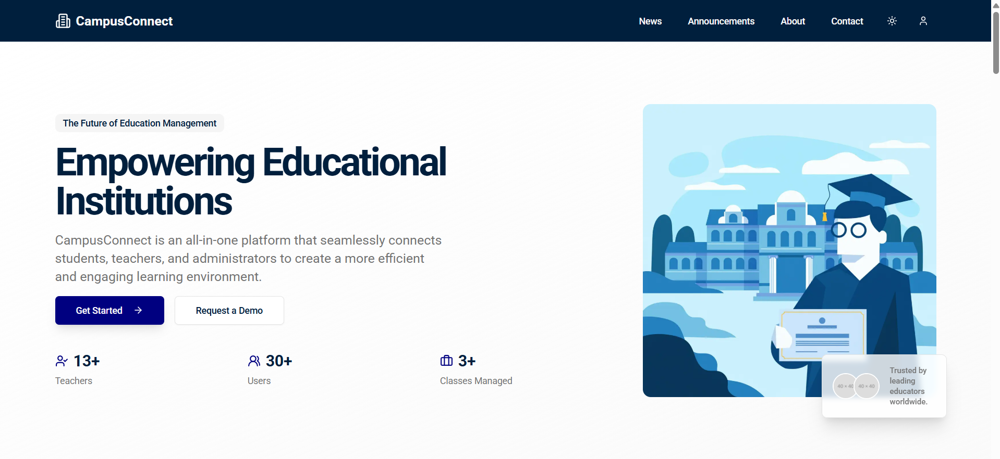

# CampusConnect

Welcome to CampusConnect, a full-stack Next.js 15 application designed for modern educational institution management. This repository contains a comprehensive solution for students, teachers, and administrators.



## What's inside?

This project includes a suite of features to manage a campus efficiently:

### Features

-   **Public Website**: A public-facing site for prospective students and visitors to learn about the campus, view news and announcements, and get in touch.
-   **Admin Dashboard**: An internal administrative portal for managing students, teachers, classes, attendance, announcements, and more.
-   **Student Portal**: A dedicated portal for students to check attendance, view grades, manage assignments, and communicate with teachers.
-   **Teacher Portal**: A specialized portal for teachers to manage their classes, take attendance, grade assignments, and oversee student progress.

### Packages & Libraries

-   `@/components`: Reusable React components, including a UI library from Shadcn.
-   `@/lib`: Shared utilities, type definitions, and mock data.
-   `@/models`: Mongoose schemas for database models.
-   `@/ai`: Genkit flows for AI-powered features.
-   `@/app/api`: Next.js API routes for backend logic.

### Architecture

-   **Framework**: Next.js 15 (App Router).
-   **State Management**: Redux Toolkit for server-side state and React Hooks for client-side state.
-   **Authentication**: Simple token-based authentication for student, teacher, and admin portals.
-   **Database**: MongoDB with Mongoose for data modeling.
-   **Styling**: Tailwind CSS with Shadcn UI for a modern, responsive design system.
-   **AI Integration**: Google's Genkit for intelligent features.

## Getting Started

To get started with this project, you'll need to have Node.js, npm/yarn/pnpm, and a MongoDB instance available.

### 1. Install Dependencies

From the root of the project, run:

```bash
npm install
```

### 2. Set up Environment Variables

Create a `.env` file at the root of the project. You can copy the contents from `config/config.js` to see the required variables.

**Required variables:**

-   `MONGODB_URI`: Your MongoDB connection string.
-   `RAZORPAY_KEY_ID`: Your Razorpay Key ID for payment processing.
-   `RAZORPAY_KEY_SECRET`: Your Razorpay Key Secret.
-   `NEXT_PUBLIC_RAZORPAY_KEY_ID`: Your public Razorpay Key ID.
-   `GEMINI_API_KEY`: Your Google AI API key for Genkit features.

### 3. Run Development Servers

To run the application in development mode, execute the following command from the root directory:

```bash
npm run dev
```

This will start the development server, typically available at `http://localhost:9002`.

## Building for Production

To build the application for production, run:

```bash
npm run build
```

---

**CampusConnect** is a full-stack application designed to empower educational administrators, support teachers, and enhance the student experience by providing a scalable, maintainable, and high-performance architecture. It combines a public-facing website, a student portal, and a teacher/admin dashboard into a single, cohesive system.

The project includes applications such as a **public-facing website**, a **secure student portal**, a **dedicated teacher portal**, and a comprehensive **admin dashboard**, along with shared components and utilities for a streamlined development experience.

The platform is built with a modern technology stack, including **Next.js 15**, **React**, **TypeScript**, **Tailwind CSS**, **Shadcn UI**, **Mongoose**, and **Genkit** for AI-powered features. This ensures a highly modular and efficient application.

---

### Copyright Notice

**CampusConnect**

Copyright © 2024. All rights reserved.

This project, **CampusConnect**, is a demonstration of a full-stack campus management system. Unauthorized use, modification, or distribution of the software or its components is prohibited unless explicitly stated under the terms of the license.

By using or contributing to this project, you agree to comply with the terms and conditions defined in the license. You may use the software for personal or educational purposes, provided that proper credit is given to the original author.

---

### License Information

This project is licensed under the MIT License. Please refer to the `LICENSE` file in this repository for detailed license information. The terms of the license govern the use, distribution, and modification of the software.

---

### Disclaimer

The software is provided "as-is" without warranty of any kind, express or implied, including but not limited to the warranties of merchantability, fitness for a particular purpose, and non-infringement. In no event shall the authors or copyright holders be liable for any claim, damages, or other liability, whether in an action of contract, tort, or otherwise, arising from, out of, or in connection with the software or the use or other dealings in the software.

---

### Trademarks

Any trademarks, service marks, or other marks associated with this project or its components are the property of their respective owners.
